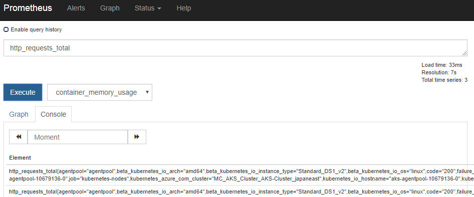
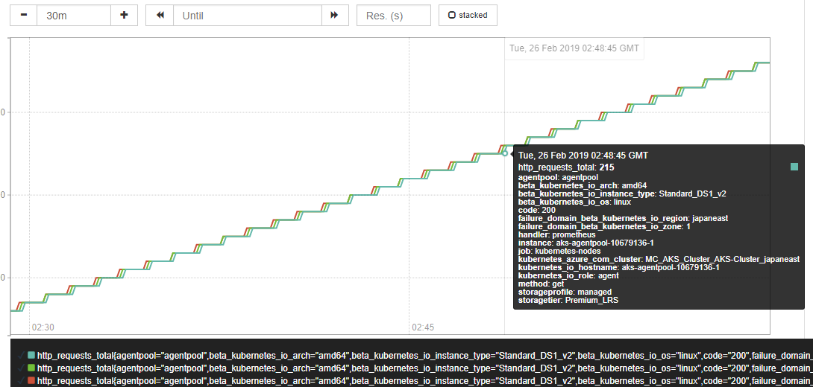
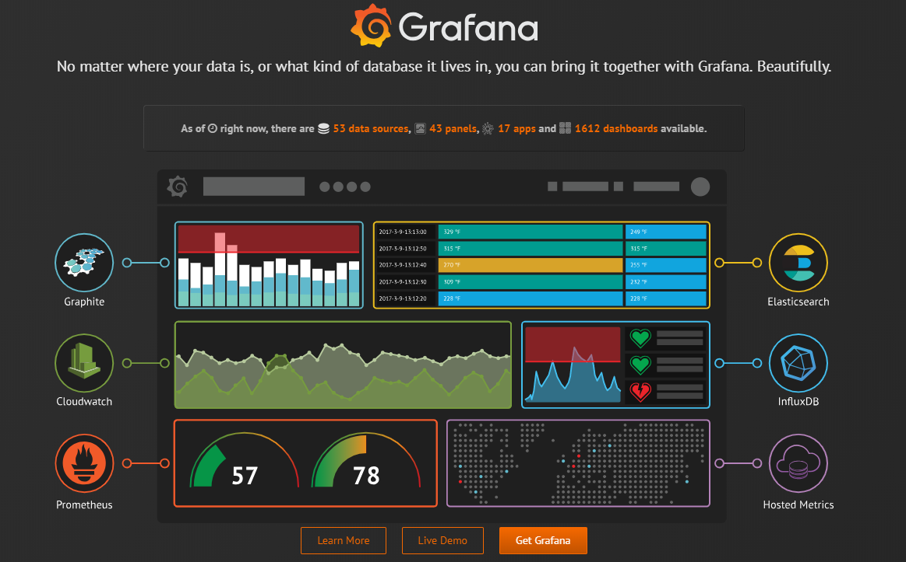

name: inverse
layout: true
class: center, middle, inverse

---
## Kubernetes入門

Monitoring

---
layout: false
### Assumptions

- Kubernetesの概要程度の知識

### Targets

- Monitoring未経験者

---
### Monitoring

- Problem Detection  
ダッシュボード、アラート

- Problem Resolution  
根本原因の特定、トラブルシュート

- Continuous Improvement  
キャパシティ、コスト最適化

---
### Observability

> a measure of how well internal states of a system can be inferred from knowledge of its external outputs.

---
<center></center>

---
### Tools

- Datadog

- Prometheus

- Managed Service
    - Azure Monitor for containers

    - Stackdriver(for GKE)

---
### Tools

- Datadog

- Prometheus

.color-gray[
- Managed Service
    - Azure Monitor for containers

    - Stackdriver(for GKE)
]

---
class: center, middle, inverse
# Datadog

---
### Datadog

.right-small[
<center></center>
]

.left-large[
- SaaS型の監視＆解析ツール

- 課金制

- 様々なサービスのメトリクスをシームレスに集約
]

---
### Dashboard

<center></center>

---
### Metrics

- ホストのCPU使用率、ディスク使用率

- ノード上のコンテナのCPU使用率

- Deployment のPod数、要求起動数

- Jobの成功数、失敗数

etc...

---
class: center, middle, inverse
# Prometheus

---
### Prometheus

.right-small[
<center></center>
]

.left-large[
- CNCFがホストするOSSの監視ツール

- 時系列でメトリクスを収集

- Reliability
]

---
### Architecture

<center></center>

---
### Architecture

- Prometheus Server  
メトリクスの収集(Pull型)、保存

- Alert Manager  

- Exporter  
要求に応じてメトリクスを送信

- Push Gateway  
メトリクスをPushしておく

---
### Install

Helmを使用してマニフェストを作成  
[公式サイト](https://helm.sh/)

```console
# Chartのダウンロード
$ helm fetch stable/prometheus --version 8.8.0

# Chartを元にマニフェストを作成
$ helm template --name sample-prometheus \
    prometheus-8.8.0.tgz \
    > sample-prometheus.yaml
```

---
### Install

LBとして外部に公開する場合は、valuesファイルを用意しておく

```yaml
alertmanager:
  service:
    type: LoadBalancer
pushgateway:
  service:
    type: LoadBalancer
server:
  service:
    type: LoadBalancer
```

---
### Install

[sample-prometheus.yaml](https://github.com/Kyohei-M/slide-k8s-monitoring/blob/master/sample-prometheus.yaml)

```console
# Prometheusを起動
$ kubectl apply -f sample-prometheus.yaml
```

---
class: center, middle, inverse
# Demo

---
### Prometheus Server

<center></center>

---
### Prometheus Server

<center></center>

---
### PromQL

Prometheus Query Language

```sql
# Example
# apiserverのhttpリクエスト合計
http_requests_total{job="apiserver"}

# 直近5分のhttpリクエストの増加率
rate(http_requests_total[5m])[30m:1m]

# 直近1時間での空きメモリ量の差
delta(node_memory_MemFree_bytes[1h])
```

---
### Grafana

.zoom1[
OSSのデータ可視化ツール
]

<center></center>

---
### Grafana

helmでインストール

```console
$ helm install -n sample-grafana stable/grafana

```

---
### Books

<center></center>

---
### Website

[Monitoring and Observability](https://thenewstack.io/monitoring-and-observability-whats-the-difference-and-why-does-it-matter/)

[Datadog - 公式](https://www.datadoghq.com/)

[Prometheus - 公式](https://prometheus.io/)

[Grafana - 公式](https://grafana.com/)